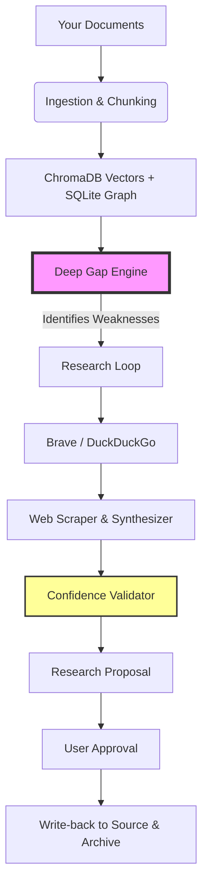

# 🧠 Personal Knowledge Research Agent

An autonomous, local-first AI research assistant and knowledge gap filler. The agent continuously analyzes your personal knowledge corpus, detects structural, semantic, and temporal knowledge gaps using a **Deep Knowledge Gap Engine**, autonomously browses and fetches external research to bridge those gaps, verifies claims against source evidence, and synthesizes structured knowledge proposals for your review and approval.

---

## 🚀 The Vision

We all have folders full of Markdown notes, PDFs, and text files. But **how do you know what you *don't* know?** 

This agent acts as your intellectual mirror. It ingests your personal knowledge, builds a semantic graph of your expertise, runs a **multi-stage "Deep Gap" analysis** to pinpoint structural weaknesses in your understanding, and then autonomously surfs the web to bring back peer-reviewed, cross-referenced research proposals for you to approve or reject.

**The Core Promise**: Transform your static note-dump into a living, self-improving knowledge ecosystem—all while keeping your data 100% local (if you use Ollama).

---

## ✨ What It Actually Does (Features)

- **📄 Multi-Format Ingestion**: Eats `.md`, `.txt`, and `.pdf` files. Automatically chunks them intelligently (with fallbacks if your formatting is messy).
- **🧠 Knowledge Graph Extraction**: Spits out concepts, keywords, and relationship triples (`X relates_to Y`) to build a traversable map of your brain.
- **🔍 Deep Knowledge Gap Engine** (The Crown Jewel):
  - Analyzes your knowledge across **10 functional roles** (Foundational, Mechanism, Implementation, Evaluation, Limitation, Failure Mode, Security, Tradeoff, Operational, Temporal).
  - Scores your depth per role (0 to 5).
  - Performs **counterfactual analysis** ("What breaks if this knowledge is missing?").
- **🌐 Autonomous Web Research**: Queries Brave Search or DuckDuckGo, scrapes the top results, and synthesizes findings.
- **📊 Multi-Source Confidence Scoring**: Weighs claims based on how many independent sources back them up (10+ sources = 90% confidence in the system's heuristic).
- **💾 Dual Persistence**: Approved research gets saved both to a central `research/` archive *and* injected back into your original source folder (so your knowledge base stays updated).
- **📈 Real-time Dashboard**: Live metrics on active gaps, resolved gaps, and pending proposals with SSE (Server-Sent Events) auto-updates.

---
---

## 🎮 The Full Workflow (From Import to Approval)

### Step 1: Ingest Your Knowledge
- Place your `.md`, `.txt`, or `.pdf` files into subfolders inside `data/documents/` (e.g., `data/documents/AI_Notes/`).
- On the Dashboard, click **"Scan & Ingest Folder"**. The backend will chunk the text, generate embeddings, and store them in ChromaDB.

### Step 2: Scan for "Deep Gaps"
- Navigate to the **"Knowledge Gaps"** tab.
- Click **"Scan for Deep Gaps"**. 
- *Wait a few minutes* (the engine runs 3-stage reasoning over your vectors). The system will generate a list of missing concepts, each tagged with a severity score and a counterfactual consequence.

### Step 3: Run Autonomous Research
- Find a gap that worries you (e.g., "Missing implementation details on X").
- Click **"Research Gap"**. Alternatively, go to the **"Research Workspace"** and type a custom query.
- The agent will fire up to 15 search queries, scrape 25 sources, and synthesize a draft proposal.

### Step 4: Review the Proposal
- Switch to the **"Proposals & Approval"** tab.
- Read the synthesized research. Look at the **Confidence Score** (color-coded: Green = >80%, Yellow = 60-80%, Red = <60%).
- **Critical Check**: Manually verify the citations. The system validates *count*, not *content* (see limitations below).

### Step 5: Approve & Persist
- Click **"Approve"**.
- The markdown file is instantly saved to:
  1. `data/documents/research/` (central archive).
  2. The *original source folder* you ingested earlier (e.g., `data/documents/AI_Notes/`).
- The dashboard counter updates, and the gap moves from "Active" to "Resolved".

---

## 📊 Evaluation Metrics & How They Are Calculated

The system includes a built-in **Evaluation & Benchmarks Engine** (`backend/app/evaluation/metrics.py`) implementing formal quantitative criteria:

```
┌─────────────────────────────────────────────────────────────────────────────┐
│                         EVALUATION METRICS FORMULA                          │
├─────────────────────────────────────────────────────────────────────────────┤
│                                                                             │
│  1. Citation Grounding Score (40% Weight):                                  │
│     Grounding = (Count of claims with valid supporting evidence) / (Total)   │
│     Measures what proportion of synthesized claims are backed by external   │
│     factual web evidence.                                                   │
│                                                                             │
│  2. Multi-Source Consensus Ratio (20% Weight):                              │
│     Consensus = (Count of claims backed by >= 2 distinct sources) / (Total) │
│     Measures whether claims represent consensus across multiple independent │
│     domains rather than a single website.                                   │
│                                                                             │
│  3. Proposal Structural Completeness (40% Weight):                          │
│     Completeness = (Passed Section Checks) / 5                              │
│     Verifies presence of:                                                   │
│       • Executive Summary                                                   │
│       • Key Concepts                                                        │
│       • Verified Findings                                                   │
│       • Markdown Citations                                                  │
│       • Bibliography / Source References                                    │
│                                                                             │
│  ═════════════════════════════════════════════════════════════════════════  │
│  Overall Quality Score = (0.4 × Grounding) + (0.2 × Consensus) +            │
│                          (0.4 × Completeness)                               │
│                                                                             │
│  Status: PASS (Score >= 0.75 / 75%) | NEEDS_IMPROVEMENT (< 0.75)            │
└─────────────────────────────────────────────────────────────────────────────┘
```

You can run the benchmark suite at any time from the **Evaluation & Metrics** tab in the web UI.

---

## 📋 Prerequisites

1. **Python**: Python 3.10 to 3.14 (with virtual environment support).
2. **Node.js**: Node.js 18+ and npm (or the portable binary in `tools/node`).
3. **Ollama (Optional, for 100% local neural execution)**:
   * Download and install from [ollama.com](https://ollama.com).
   * Pull recommended models:
     ```bash
     ollama pull llama3.2
     ollama pull nomic-embed-text
     ```
4. **Brave Search API Key (Recommended for live web search)**:
   * Obtain a free API key at [brave.com/search/api/](https://brave.com/search/api/).

## 🛠️ Tech Stack

| Layer | Technology |
| :--- | :--- |
| **Backend Framework** | FastAPI (Python 3.10+) |
| **Vector DB** | ChromaDB (Local) |
| **Relational DB** | SQLite (via SQLAlchemy) |
| **LLM Interface** | Ollama (Optional) / OpenAI Compatible |
| **Web Scraping** | BeautifulSoup4 + Requests (Static) |
| **Search APIs** | Brave Search / DuckDuckGo (`ddgs`) |
| **Frontend** | React 18 + Vite + Tailwind CSS |
| **Testing** | Pytest (Unit & Integration Mocks) |

---

## ⚡ Quick Start (Getting It Running)

> **⚠️ Prerequisite Warning**: This is a heavy local stack. Ensure you have at least 8GB of RAM free. 

### 1. Clone & Environment
```bash
git clone https://github.com/Sri-Nidhi-25/Personal-Knowledge-Research-Agent.git
cd Personal-Knowledge-Research-Agent
```

### 2. Backend Setup (Python)
```bash
python -m venv backend/venv
source backend/venv/bin/activate  # On Windows: backend\venv\Scripts\activate
pip install -r backend/requirements.txt
```

### 3. Frontend Setup (Node)
```bash
cd frontend
npm install
cd ..
```

### 4. Pull Local Models (if using Ollama)
```bash
ollama pull llama3.2
ollama pull nomic-embed-text
```

### 5. Run the Stack
- **Terminal 1 (Backend)**: `uvicorn backend.app.main:app --host 0.0.0.0 --port 8000 --reload`
- **Terminal 2 (Frontend)**: `cd frontend && npm run dev`

Access the UI at `http://localhost:3000` and the API docs at `http://localhost:8000/docs`.

---

## 🧪 Running Automated Tests

The test suite covers unit tests, deep gap engine, chunking retries, claim verification, API endpoints, and SSE streaming.

```powershell
# On PowerShell
.\backend\venv\Scripts\pytest.exe backend/tests/ -v
```

---

## 📁 Repository Structure

```
├── backend/
│   ├── app/
│   │   ├── agent/            # Research orchestrator, planner, unified LLM client
│   │   ├── api/              # FastAPI routers (documents, gaps, research, eval, health)
│   │   ├── config/           # Settings and environment configuration management
│   │   ├── evaluation/       # Benchmark suite and metrics engine (Grounding, Consensus)
│   │   ├── knowledge/        # Chunking with retry, embeddings, ingestion, graph, deep_gap_engine
│   │   │   ├── deep_gap_engine.py  # Deep Knowledge Gap Engine (Coverage Matrix, Counterfactual)
│   │   │   ├── gap_discovery.py    # Gap discovery service and CRUD persistence
│   │   │   ├── knowledge_repr.py   # Concept registry and graph extraction
│   │   │   ├── ingestion.py        # Multi-format document parser and pipeline
│   │   │   ├── chunking.py         # Resilient heading-aware text chunking with retries
│   │   │   ├── index_service.py    # Pipeline-level indexing orchestrator with retry/cleanup
│   │   │   └── embeddings.py       # Pluggable vector embeddings (Ollama, FastEmbed, Hash)
│   │   ├── models/           # Pydantic schemas (KnowledgeGap, ResearchPlan, Proposal)
│   │   ├── storage/          # SQLite database (app.db) and ChromaDB vector store
│   │   ├── synthesis/        # Proposal markdown synthesizer with >= 75% confidence gate
│   │   ├── tools/            # Real web search (Brave / DDG), web scraper with headers
│   │   └── verification/     # 10+ source confidence verifier & contradiction detector
│   └── tests/                # 58+ unit, regression, and API integration test cases
├── frontend/
│   ├── src/
│   │   ├── api/              # REST client and SSE event subscriber
│   │   └── App.jsx           # Dashboard, Gaps, Workspace, Proposals, and Evaluation tabs
│   ├── package.json
│   └── vite.config.js
├── data/
│   ├── documents/            # Source topic folders and approved research notes
│   ├── database/             # SQLite application database (app.db)
│   └── chroma/               # ChromaDB persistent vector index
├── tools/node/               # Portable Node.js binaries
└── .env                      # Application environment configuration
```
---

## 🧠 How It Thinks (Architecture)


---

## 🚀 Future Roadmap (Fixing the Bad)

We aren't delusional. Here is the concrete roadmap to turn this prototype into a warhorse:

- **[Q4 2026] Dynamic Web Rendering**: Replace BeautifulSoup with **Playwright** or **Selenium** to handle JavaScript-heavy SPAs. 
- **[Q4 2026] Router Architecture**: Route *structural reasoning* tasks (Gap analysis) to a strong remote model (GPT-4o-mini) while keeping *embedding* and *simple extraction* local, giving users a hybrid privacy/performance toggle.
- **[Q1 2027] Citation Backtracking**: Implement a verifier that actually scrapes the cited URL and checks if the quoted sentence exists verbatim (semantic similarity check). Confidence scores will be based on *textual overlap*, not just URL count.
- **[Q1 2027] Git Integration**: Instead of directly writing back to source folders, we will generate a Git diff/Pull Request structure so users can review changes line-by-line before merging.
- **[Q2 2027] Async Job Queue**: Replace blocking SSE loops with **Celery + Redis** to handle background tasks with proper lifecycle management, pausing, and cancellation.
- **[Q2 2027] Robust Search Abstraction**: Build an internal headless browser fallback for DuckDuckGo and add a strict rate-limiter for Brave to prevent hard crashes.

---

## 🛡️ License

MIT License. Designed for autonomous, private personal knowledge expansion.

