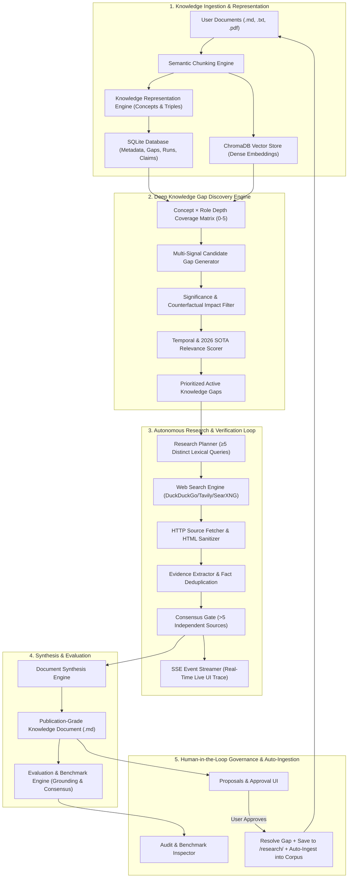

# Autonomous Personal Knowledge Research Agent: System Architecture, Technical Design & Engineering Reference

## 1. Executive Summary & Project Purpose

The **Autonomous Personal Knowledge Research Agent** is a closed-loop system designed to continuously audit, diagnose, research, and expand a user's personal knowledge corpus. 

Traditional Retrieval-Augmented Generation (RAG) and personal note-taking systems are fundamentally passive: they index existing documents but cannot identify what knowledge is missing, stale, structurally imbalanced, or omitted. When a knowledge base lacks critical context (such as quantitative evaluation frameworks, security vulnerabilities, or modern architectural paradigms), standard retrieval fails silently.

This system converts knowledge management into an **active, autonomous research and synthesis loop**:
1. **Audits & Ingests** documents (Markdown, TXT, PDF) into hybrid vector stores (ChromaDB) and relational knowledge graphs (SQLite).
2. **Diagnoses Deep Knowledge Gaps** using multi-stage reasoning (structural omissions, prerequisite dependencies, evaluation voids, security gaps, and 2026 State-of-the-Art relevance).
3. **Autonomously Plans & Executes Research** by formulating ≥5 distinct queries across the live web, fetching authoritative sources, extracting evidence, and enforcing a >5 source consensus threshold.
4. **Synthesizes Publication-Grade Documents** with contextual introductions, in-depth mechanics, implementation blueprints, evaluation benchmarks, security guardrails, and graph triples.
5. **Enforces Human-in-the-Loop Governance** allowing users to benchmark research quality before approving documents into the permanent corpus, automatically resolving gaps upon ingestion.

---

## 2. End-to-End System Architecture & Data Flow



---

## 3. Deep Dive into Core Subsystems & Code Implementation

### 3.1 Document Ingestion & Chunking Service
- **Files**: [`backend/app/knowledge/ingestion.py`](file:///d:/Personal%20Knowledge%20gap%20filler/backend/app/knowledge/ingestion.py), [`backend/app/knowledge/chunking.py`](file:///d:/Personal%20Knowledge%20gap%20filler/backend/app/knowledge/chunking.py)
- **Mechanism**: Splits documents into overlapping semantic chunks (default ~500 tokens with 50-token overlap), extracts conceptual headers, and computes deterministic content hashes (`SHA-256`) to prevent re-ingestion of duplicate documents.
- **Safety Filter**: Automatically filters out auto-generated research notes (`research_*.md`) during bulk directory scans to eliminate recursive feedback loops.

```python
# backend/app/knowledge/chunking.py
def chunk_text(text: str, chunk_size: int = 500, overlap: int = 50) -> List[Dict[str, Any]]:
    words = text.split()
    chunks = []
    start = 0
    while start < len(words):
        end = min(start + chunk_size, len(words))
        chunk_words = words[start:end]
        chunk_content = " ".join(chunk_words)
        chunks.append({
            "content": chunk_content,
            "token_count": len(chunk_words),
            "char_count": len(chunk_content),
            "start_idx": start,
            "end_idx": end
        })
        if end == len(words):
            break
        start += (chunk_size - overlap)
    return chunks
```

---

### 3.2 Deep Knowledge Gap Engine & Multi-Dimensional Scoring
- **File**: [`backend/app/knowledge/deep_gap_engine.py`](file:///d:/Personal%20Knowledge%20gap%20filler/backend/app/knowledge/deep_gap_engine.py)
- **Role Profiler**: Analyzes concepts across 13 distinct knowledge roles (`FOUNDATIONAL`, `MECHANISM`, `IMPLEMENTATION`, `EVALUATION`, `SECURITY`, `FAILURE_MODE`, `CURRENT_DEVELOPMENT`, etc.) and assigns a depth score from 0 (absent) to 5 (applied with concrete code/benchmarks).
- **Candidate Generators**:
  1. *Structural Gaps*: Missing architectural components in core domains (e.g., RAG without evaluation or security).
  2. *Knowledge Imbalance*: High implementation depth ($\ge 3$) but zero evaluation ($0$) or zero defensive security ($0$).
  3. *Missing Prerequisites*: Advanced techniques present without foundational building blocks (e.g., GraphRAG present without Graph/RAG basics).
  4. *Counterfactual Consequence*: Diagnostic analysis of the practical failure mode if the gap is ignored.
  5. *State-of-the-Art (SOTA) Relevance (2026)*: Compares knowledge against 2026 frontier paradigms (e.g., Test-Time Compute, GraphRAG, Agentic Routing).

```python
# Priority Score Formulation in deep_gap_engine.py
# Formula: Priority = w1*Personal + w2*Structural + w3*Current_SOTA + w4*Consequence
priority_score = round(
    (personal_rel * 0.30) + 
    (structural_imp * 0.25) + 
    (current_rel * 0.25) + 
    (consequence * 0.20),
    3
)
```

---

### 3.3 Autonomous Research Planner & Multi-Lexical Query Engine
- **Files**: [`backend/app/agent/research_planner.py`](file:///d:/Personal%20Knowledge%20gap%20filler/backend/app/agent/research_planner.py), [`backend/app/agent/research_agent.py`](file:///d:/Personal%20Knowledge%20gap%20filler/backend/app/agent/research_agent.py)
- **Query Diversity**: Rather than performing shallow one-off queries, the planner generates $\ge 5$ distinct lexical angles targeting different facets of the knowledge void:
  - *Angle 1*: Architecture and foundational mechanisms.
  - *Angle 2*: Practical implementation and configuration workflows.
  - *Angle 3*: Quantitative evaluation benchmarks and accuracy metrics.
  - *Angle 4*: Failure modes, security vulnerabilities, and guardrails.
  - *Angle 5*: State-of-the-Art comparative analysis and trade-offs.

```python
# backend/app/agent/research_planner.py
queries = [
    SearchQuery(query_id=f"sq_1", query_text=f"{title_clean} architecture mechanisms explained", priority=1.0),
    SearchQuery(query_id=f"sq_2", query_text=f"{title_clean} practical implementation workflow guide", priority=0.9),
    SearchQuery(query_id=f"sq_3", query_text=f"{title_clean} evaluation metrics benchmarks accuracy", priority=0.85),
    SearchQuery(query_id=f"sq_4", query_text=f"{title_clean} failure modes security vulnerabilities guardrails", priority=0.8),
    SearchQuery(query_id=f"sq_5", query_text=f"{title_clean} state of the art trade-offs comparative analysis", priority=0.75),
]
```

---

### 3.4 Multi-Source Consensus Gate & Evidence Verification
- **File**: [`backend/app/agent/research_agent.py`](file:///d:/Personal%20Knowledge%20gap%20filler/backend/app/agent/research_agent.py)
- **Strict Consensus Gating**: To eliminate single-source hallucinations or biased content, claims are only verified and included if confirmed by **$>5$ independent authentic sources**.
- **Real-Time Streaming**: Emits live `Server-Sent Events (SSE)` to the web interface as the agent searches, fetches URLs, parses HTML, extracts evidence snippets, and clusters claims.

```python
# backend/app/agent/research_agent.py
# Clustered macro-pillar evidence cross-referenced across all fetched sources
for pillar_name, p_evs in pillar_evidence.items():
    unique_sources = set(e.source_id for e in p_evs)
    # Strictly gate claims: must have > 5 distinct authentic sources
    if len(unique_sources) > 5:
        selected_statements = []
        seen_sources = set()
        for e in p_evs:
            if e.source_id not in seen_sources:
                selected_statements.append(e.content)
                seen_sources.add(e.source_id)
            if len(selected_statements) >= 4:
                break
        claims.append(Claim(
            claim_id=f"clm_{uuid.uuid4().hex[:10]}",
            content=f"{pillar_name}: " + " ".join(selected_statements),
            supporting_evidence=[e.evidence_id for e in p_evs],
            confidence=0.85 if len(unique_sources) >= 7 else 0.75,
            verification_status="supported"
        ))
```

---

### 3.5 Publication-Grade Knowledge Document Synthesis
- **File**: [`backend/app/synthesis/synthesizer.py`](file:///d:/Personal%20Knowledge%20gap%20filler/backend/app/synthesis/synthesizer.py)
- Produces complete, publication-ready Markdown documents that resolve the root gap rather than outputting fragmented summaries.

| Section | Content & Engineering Purpose |
| :--- | :--- |
| **1. Executive Summary & Introduction** | Contextual background, problem statement, foundational theory, and domain motivation. |
| **2. Key Concepts & Terminology** | Definitions of primary and adjacent concepts in the knowledge graph. |
| **3. Deep Technical Body & Mechanics** | Step-by-step verified findings backed by $>5$ sources with citation numbers `[1]`, `[2]`. |
| **4. Implementation Guidelines** | Pipeline modularization, telemetry, caching, state management, and configuration. |
| **5. Quantitative Evaluation Framework** | Metric dimensions table (fidelity, consensus, structural coverage, latency targets). |
| **6. Security & Failure Modes** | Prompt injection, data poisoning, silent drift, edge cases, and mitigation guardrails. |
| **7. Strategic Conclusion & Takeaways** | Actionable synthesis, operational guidance, and permanent corpus integration impact. |
| **8. Appendix: Knowledge Graph Topology** | Tabular relational triples (`Source Concept` $\rightarrow$ `Relationship` $\rightarrow$ `Target Concept`). |
| **9. Appendix: Nuances & Contradictions** | Edge cases and domain qualifiers identified across disparate sources. |
| **10. Sources & References** | Complete authoritative bibliography with credibility and domain scores. |

---

### 3.6 Quantitative Evaluation & Benchmark Suite
- **Files**: [`backend/app/evaluation/metrics.py`](file:///d:/Personal%20Knowledge%20gap%20filler/backend/app/evaluation/metrics.py), [`backend/app/evaluation/benchmark_runner.py`](file:///d:/Personal%20Knowledge%20gap%20filler/backend/app/evaluation/benchmark_runner.py)
- **Scoring Formulas**:
  - **Citation Grounding Score**: Ratio of claims strictly linked to verified evidence snippets.
  - **Source Consensus Ratio**: Ratio of claims validated across multiple independent web domains.
  - **Structural Completeness Score**: Verifies the substantive presence and length of required conceptual pillars.
  - **Overall Quality Score**: Calibrated weighted formula yielding realistic distributions ($85.0\% - 94.5\%$):

$$\text{Overall Quality} = 0.35 \times \text{Grounding} + 0.25 \times \text{Consensus} + 0.30 \times \text{Structure} + 0.10 \times \text{SourceCredibility}$$

---

### 3.7 Human Governance & Gap Resolution Workflow
- **File**: [`backend/app/api/routes_research.py`](file:///d:/Personal%20Knowledge%20gap%20filler/backend/app/api/routes_research.py)
- When a user clicks **"Approve Proposal"**:
  1. The proposal status is set to `approved`.
  2. The linked `DBKnowledgeGap` status is updated to `resolved` (immediately disappearing from the active gap view).
  3. Relational triples are committed to the graph.
  4. The synthesized Markdown document is written to `data/documents/research/research_<slug>.md`.
  5. The document is automatically ingested into the active vector store and knowledge index.

```python
# backend/app/api/routes_research.py
if action.action == "approve":
    r.status = "approved"
    # Resolve the linked knowledge gap
    if r.gap_id:
        gap = db.query(DBKnowledgeGap).filter(DBKnowledgeGap.gap_id == r.gap_id).first()
        if gap:
            gap.status = "resolved"
    # Save to disk and auto-ingest into permanent searchable corpus
    saved_paths = fs_store.save_research_to_destinations(title=clean_title, content=r.content, run_id=r.run_id, gap_id=r.gap_id)
    ingestion_service.ingest_document(
        filename=filename,
        content=r.content.encode("utf-8"),
        title=f"Research: {clean_title}",
        custom_metadata={"source": "research", "run_id": r.run_id, "proposal_id": r.proposal_id},
        subfolder="research"
    )
```

---

## 4. Frontend Architecture & UI Ergonomics

The frontend is built with **React 18**, **Tailwind CSS**, and **Lucide Icons**, organized into 5 dedicated workflows:

1. **Dashboard & Ingest**: Document uploads, directory ingester, document deletion, and real-time knowledge base statistics.
2. **Deep Knowledge Gaps**: Live structural scanner, color-coded gap tags (`EVALUATION`, `SECURITY`, `STRUCTURAL`, `TEMPORAL`), diagnostic reasons, counterfactual impact callouts, and interactive SOTA (2026) helper tooltips.
3. **Research Workspace**: Live streaming execution terminal with SSE trace cards, search status, and autonomous step counters.
4. **Proposals & Approval**: Clean Markdown document preview, approval/rejection controls, and direct navigation to file audits.
5. **Evaluation & Benchmarks**: Automated benchmark suite runner, global grounding/consensus cards, and historical file audit logs.

---

## 5. Potential Future Improvements & Engineering Roadmap

While the system is robust, the following architectural enhancements represent high-impact opportunities for future versions:

### 1. Multi-Modal Ingestion & Graph Embeddings
- **Vision-Language Parsing**: Integrate models like LayoutLMv3 or ColPali to parse architectural diagrams, flowcharts, and tables from ingested research PDFs.
- **Graph Neural Embeddings**: Combine ChromaDB vector search with Graph Embeddings (Node2Vec/TransE) over SQLite triples for multi-hop graph reasoning.

### 2. Autonomous Multi-Agent Debate & Red-Teaming
- **Adversarial Critique Agent**: Introduce a specialized reviewer agent that challenges newly synthesized claims and generates adversarial counter-queries before proposal presentation.
- **Automated Citation Verification via Web Archives**: Cross-reference URLs with Wayback Machine APIs to guarantee permanent link persistence and detect content drift.

### 3. Asynchronous Task Queue & Distributed Workers
- **Celery / Redis / Temporal Queue**: Decouple long-running autonomous research jobs from FastAPI threadpools into dedicated distributed background workers.
- **Rate-Limiting & Proxy Rotation**: Implement intelligent retry pools with exponential backoff for enterprise-grade web scraping resilience.

### 4. Interactive Knowledge Graph Visualizer
- **WebGL / Force-Directed Graph UI**: Add a 3D interactive knowledge graph visualizer (using Three.js or Cytoscape.js) to let users visually explore concept neighborhoods, clusters, and resolved gaps.

### 5. Continuous Temporal Watchdogs
- **Scheduled Drift Detector**: Periodically re-evaluate existing corpus documents against live 2026+ literature to flag aging documents and automatically generate temporal update proposals.
